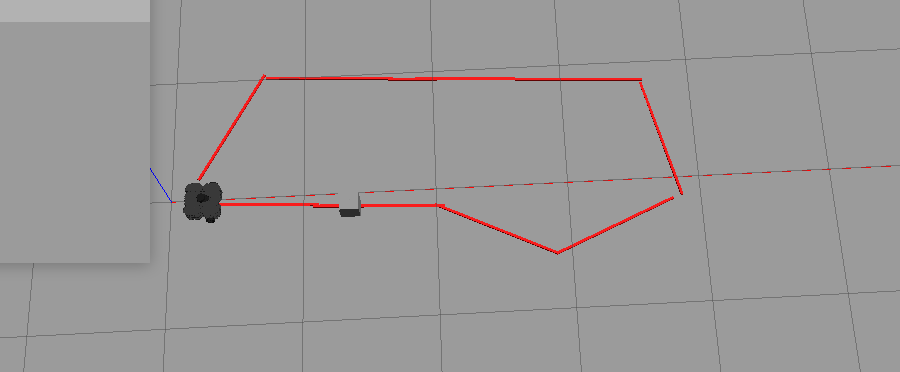

Line fallower & Obstacle Avoider robot




===============

### Technologies used

- Ubuntu distro : 18.04 LTS 

- ROS distro: Melodic (tested on Noetic too)

- Robot to use in simulation: Turtlebot3

- Gazebo version : 9+

- Python: rospy, openCv


---

## Disclamer

This article assumes having basic knowledge of ROS, Python, Gazebo, LiDARs, and Linux, since these will not be covered here.


#### Get started with ROS

If you want to get started with ROS, read this [doc](https://docs.google.com/document/d/1VXA88LlZBkRv_2Z2--jHAbQZDKCOZ0l3LTyKR5cDM5o/edit?usp=sharing).

---

## How this code works:

The overall workflow of the code involves continuously processing camera images for red line detection and laser scan data for obstacle detection. The robot responds to the detected conditions by adjusting its velocity commands. When an obstacle is detected, the robot follows a predefined obstacle avoidance sequence to navigate around it.

---

## How to use

1: Download the files:
```
git clone 'https://github.com/HamidEmreDirim/line_fallower_with_obstacle_avoidance'
```

2: Add "model_editor_models" file to your ros model path. If you haven't added a model path simply add this command to your .bashrc:
```
export ROS_PACKAGE_PATH=/path/to/your/robot_model:$ROS_PACKAGE_PATH
```
3: Navigate to your catkin_ws and run catkin_make:

```
cd catkin_ws/
catkin_make
```

4: Start the simulation by default I have included 1 map insite "my_simulations" file:
```
roslaunch my_simulations my_world.launch
```

5: After the initilasion of the world run the "line_fallower_with_obstacle_avoidance.py" script:

```
rosrun command_turtle line_fallower_with_obstacle_avoidance.py
```

